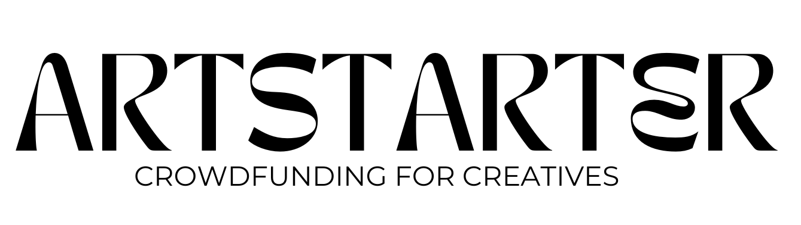

# Crowdfunding Front-End

Goya Zheng

# Artstarter: crowdfunding for creatives

A platform for making the making easy. Spend more time creating and less time writing grant applications. A simple way to crowdfund for your next creative project. From music, to art, photography and all artistic outlets in between.

## Project requirements

### Deployed Project Link

https://artstarter.netlify.app/

[x] Be separated into two distinct projects: an API built using the Django RestFramework and a website built using React.

[x] Have a cool name, bonus points if it includes a pun and/or missing vowels. Seehttps://namelix.com/ for inspiration. (Bonus Points are meaningless)

[x] Have a clear target audience.

[x] Have user accounts. A user should have at least the following attributes:

[x] Username

[x] Email address

[x] Password

[x] Ability to create a “project” to be crowdfunded which will include at least thefollowing attributes:

[x] Title

[x] Owner (a user)

[x] Description

[x] Image

[x] Target amount to fundraise

[x] Whether it is currently open to accepting new supporters or not

[x] When the project was created

[x] Ability to “pledge” to a project. A pledge should include at least the followingattributes:

[x] An amount

[x] The project the pledge is for

[ ] The supporter/user (i.e. who created the pledge)

[x] Whether the pledge is anonymous or not

[x] A comment to go along with the pledge

[ ] Implement suitable update/delete functionality, e.g. should a project owner be allowed to update a project description?

[ ] Implement suitable permissions, e.g. who is allowed to delete a pledge?

[x] Return the relevant status codes for both successful and unsuccessful requests to the API.

[ ] Handle failed requests gracefully (e.g. you should have a custom 404 page rather than the default error page).

[x] Use Token Authentication

[ ] Implement responsive design

[ ] A screenshot of the homepage

[ ] A screenshot of the project creation page

[ ] A screenshot of the project creation form

[ ] A screenshot of a project with pledges

[ ] A screenshot of the resulting page when an unauthorized user attempts to edit a project
