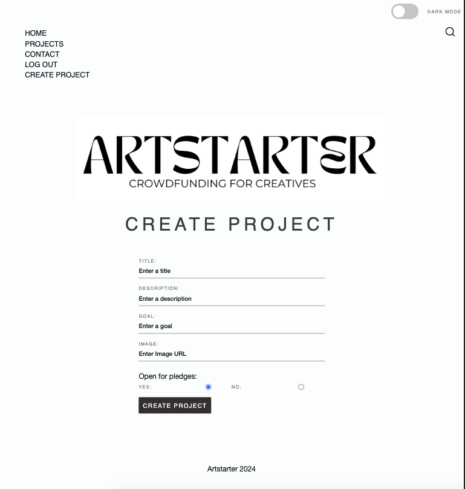

# Crowdfunding Front-End

Goya Zheng

## Artstarter: crowdfunding for creatives

A platform for making the making easy. Spend more time creating and less time writing grant applications. A simple way to crowdfund for your next creative project. From music, to art, photography and all artistic outlets in between.

### Project requirements

#### Deployed Project Link: https://artstarter.netlify.app/

[x] Be separated into two distinct projects: an API built using the Django RestFramework and a website built using React.

[x] Have a cool name, bonus points if it includes a pun and/or missing vowels. Seehttps://namelix.com/ for inspiration. (Bonus Points are meaningless)
[x] Have a clear target audience.

[x] Have user accounts. A user should have at least the following attributes:

[x] Username 
[x] Email address 
[x] Password 

[x] Ability to create a “project” to be crowdfunded which will include at least the following attributes:

[x] Title 
[x] Owner (a user) 
[x] Description 
[x] Image 
[x] Target amount to fundraise 
[x] Whether it is currently open to accepting new supporters or not 
[x] When the project was created

[x] Ability to “pledge” to a project. A pledge should include at least the following attributes:

[x] An amount 
[x] The project the pledge is for 
[x] The supporter/user (i.e. who created the pledge) 
[x] Whether the pledge is anonymous or not 
[x] A comment to go along with the pledge 
[ ] Implement suitable update/delete functionality, e.g. should a project owner be allowed to update a project description? 
[ ] Implement suitable permissions, e.g. who is allowed to delete a pledge?

[x] Return the relevant status codes for both successful and unsuccessful requests to the API. 
[x] Handle failed requests gracefully (e.g. you should have a custom 404 page rather than the default error page). 
[x] Use Token Authentication 
[x] Implement responsive design

## A screenshot of the homepage

#### Mobile

#### Desktop

## A screenshot of the project creation page

#### Desktop - Single Project with Pledges

#### Desktop - Project List

## A screenshot of the project creation form

#### Mobile

#### Desktop

## A screenshot of the resulting page when an unauthorized user attempts to edit a project

#### Desktop

## Contact Form

#### Mobile

#### Desktop

